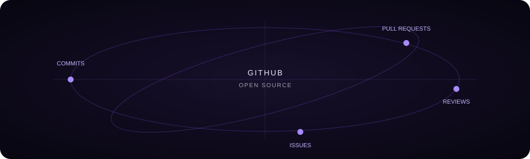

 

## About

I'm a **Computer Science student at SRM Institute of Science and Technology**, focused on **Java backend engineering** and building practical, production-style applications.

My current work centers on **Spring Boot, Spring Security, REST APIs, JPA/Hibernate, relational databases, caching, and event-driven systems**. Alongside backend development, I spend consistent time on **Data Structures & Algorithms and open-source contributions**.

I'm currently exploring **Docker, AWS, system design, and distributed systems** to understand how backend services scale beyond a single application.

## At a glance

| 9.2 / 10 | 171 | 1st Place |
|:---:|:---:|:---:|
| **CGPA** | **LeetCode Problems** | **NitroStack Hackathon** |

## Technical Stack

**Languages**  
`Java` `Python` `C` `C++`

**Backend**  
`Spring Boot` `Spring Security` `REST APIs` `JPA / Hibernate`

**Data & Infrastructure**  
`MySQL` `MongoDB` `Redis` `Kafka` `TiDB Cloud`

**Tools & Platforms**  
`Git` `GitHub` `IntelliJ IDEA` `Postman` `Render`

**Currently Exploring**  
`Docker` `AWS` `System Design` `Distributed Systems`

## Featured Projects

### 📚 Library Management System
**Java · Spring Boot · Spring Data JPA · MySQL · Spring Security · JWT · Swagger**

A backend application for managing books, users, and issue/return workflows with authentication and persistent database storage.

[View repository →](https://github.com/Ayush0612005/library-management-system-springboot)

### 💸 Expense Tracker
**Java · Spring Boot · MySQL · Redis · Kafka · REST API**

Backend service for personal expense management, with persistent storage, caching, and event-driven audit processing.

[View repository →](https://github.com/Ayush0612005/expense_tracker)

### 🔗 URL Shortener
**Java · Spring Boot · MySQL · Redis · JWT · Swagger · JUnit**

A RESTful service for URL creation and redirection with Redis caching, JWT authentication, API documentation, and unit tests.

[View repository →](https://github.com/Ayush0612005/url-shortener-springboot)

### 🛒 E-Commerce Platform
**Spring Boot · React · MySQL**

A full-stack e-commerce application bringing together a Java backend, relational persistence, and a React frontend.

[View repository →](https://github.com/Ayush0612005/ecommerce-fullstack)

## NitroStack Hackathon

**1st Place — NitroStack Hackathon**

Built and presented a solution under hackathon constraints as part of a competitive engineering team, focusing on implementation quality and practical problem solving.

[View project →](https://github.com/Ayush0612005/nitrostack)

## Open Source

I contribute to open-source projects to work with unfamiliar codebases, collaborate through pull requests, and learn engineering practices beyond personal projects.

Recent work includes contributions to **spring-lens** and **nv-i18n**, with a focus on understanding existing architecture and making targeted changes.

- [spring-lens](https://github.com/Ayush0612005/spring-lens)
- [nv-i18n](https://github.com/Ayush0612005/nv-i18n)

## GitHub Activity

 

 

## Problem Solving

Consistent practice across `Arrays`, `Strings`, `Linked Lists`, `Binary Search`, `Sorting`, `Recursion`, and broader problem-solving patterns.

## Education

**SRM Institute of Science and Technology — Kattankulathur**  
B.Tech · Computer Science Engineering (Core)  
**CGPA: 9.2 / 10**

## Currently Learning

`Docker` · `AWS` · `System Design` · `Distributed Systems` · `Kafka` · `Redis` · `Advanced DSA`

### Build. Learn. Contribute.

<a href="https://github.com/Ayush0612005">GitHub</a> ·
<a href="https://www.linkedin.com/in/ayush-kulshreshtha-0066661b9/">LinkedIn</a> ·
<a href="https://leetcode.com/">LeetCode</a> ·
<a href="mailto:ayushkulshreshtha37@gmail.com">Email</a>

