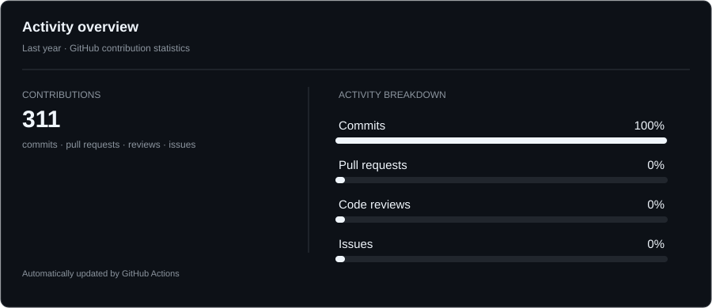

# Ayush Kulshrestha

**Computer Science Student · Java Backend Developer · SRMIST**

I'm a Computer Science Engineering student at **SRM Institute of Science and Technology, Kattankulathur**, focused on backend development with Java.

I build practical applications with **Java, Spring Boot, Spring Security, REST APIs, JPA/Hibernate and MySQL**. I'm currently extending that work into **Redis, Kafka, Docker, AWS and distributed systems**. Alongside development, I consistently practice Data Structures & Algorithms and contribute to open-source projects.

**9.2 CGPA** · **171 LeetCode problems** · **1st Place, NitroStack Hackathon**

---

## What I work with

**Languages**  
Java · Python · C · C++

**Backend**  
Spring Boot · Spring Security · REST APIs · JPA / Hibernate

**Data & Infrastructure**  
MySQL · MongoDB · Redis · Kafka · TiDB Cloud

**Tools**  
Git · GitHub · IntelliJ IDEA · Postman · Render

---

## What I've built

### Library Management System

A Spring Boot backend for managing books, users and issue/return workflows, with JWT authentication, validation, JPA/Hibernate and MySQL.

**Java · Spring Boot · Spring Security · JWT · JPA · MySQL · Swagger**  
[Repository](https://github.com/Ayush0612005/library-management-system-springboot)

### Expense Tracker

A backend service for personal expense management using persistent storage, Redis caching and Kafka-based event processing.

**Java · Spring Boot · MySQL · Redis · Kafka**  
[Repository](https://github.com/Ayush0612005/expense_tracker)

### URL Shortener

A RESTful URL-shortening service with authentication, Redis caching, API documentation and unit testing.

**Java · Spring Boot · MySQL · Redis · JWT · Swagger · JUnit**  
[Repository](https://github.com/Ayush0612005/url-shortener-springboot)

### E-Commerce Platform

A full-stack e-commerce application combining a Spring Boot backend, MySQL persistence, REST APIs and a React frontend.

**Spring Boot · React · MySQL**  
[Repository](https://github.com/Ayush0612005/ecommerce-fullstack)

---

## Open Source

I contribute to open-source projects to work with existing codebases, understand unfamiliar architecture and collaborate through pull requests.

Recent contributions include work around:

- [spring-lens](https://github.com/Ayush0612005/spring-lens)
- [nv-i18n](https://github.com/Ayush0612005/nv-i18n)

---

## GitHub Activity

---

## Problem Solving

**171 LeetCode problems solved**

Regular practice across:

`Arrays` · `Strings` · `Linked Lists` · `Binary Search` · `Sorting` · `Recursion`

---

## Achievement

**1st Place — NitroStack Hackathon**

Built and presented a working solution under hackathon constraints as part of a competitive engineering team.

---

## Education

**SRM Institute of Science and Technology — Kattankulathur**  
B.Tech · Computer Science Engineering (Core)  
**CGPA: 9.2 / 10**

---

## Currently learning

Docker · AWS · System Design · Distributed Systems · Kafka · Redis · Advanced DSA

---

## Say hi 👋

[GitHub](https://github.com/Ayush0612005) · [LinkedIn](https://www.linkedin.com/in/ayush-kulshreshtha-0066661b9/) · [Email](mailto:ayushkulshreshtha37@gmail.com)
