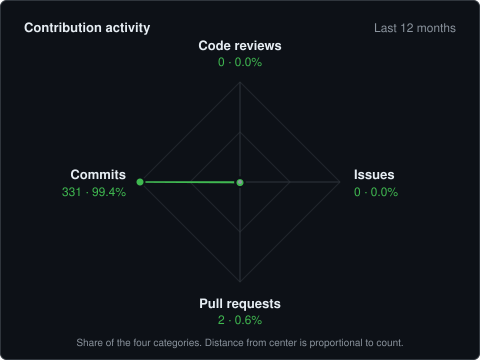

# Ayush Kulshreshtha

**Computer Science Student · Java Backend Developer · SRMIST**

Second-year B.Tech Computer Science student at SRM Institute of Science and Technology, Kattankulathur, focused on backend engineering with Java. I build REST services with Spring Boot, Spring Security, JPA/Hibernate and MySQL, and I'm extending that work into Redis, Kafka, Docker and AWS. I practice DSA regularly and work in open-source codebases to learn how real projects are built.

`CGPA 9.2 / 10` · `171 LeetCode problems solved` · `1st Place, NitroStack Hackathon`

---

## What I work with

**Languages**  
`Java` `Python` `C` `C++`

**Backend**  
`Spring Boot` `Spring MVC` `Spring Security` `JWT` `REST APIs` `JPA` `Hibernate` `JDBC` `Maven` `Swagger / OpenAPI`

**Data & Infrastructure**  
`MySQL` `MongoDB` `Redis` `Kafka` `TiDB Cloud`

**Tools**  
`Git` `GitHub` `IntelliJ IDEA` `Postman` `Render` `MySQL Workbench` `Android Studio`

---

## What I've built

**[Library Management System](https://github.com/Ayush0612005/library-management-system-springboot)** — Backend for managing books, users and issue/return workflows. Authentication and authorization with Spring Security and JWT, request validation, persistence through Spring Data JPA and MySQL, REST APIs documented with Swagger.  
`Java` `Spring Boot` `Spring Security` `JWT` `Spring Data JPA` `Hibernate` `MySQL` `Swagger`

**[Expense Tracker](https://github.com/Ayush0612005/expense_tracker)** — Expense management backend with MySQL persistence, Redis caching and Kafka-based event processing.  
`Java` `Spring Boot` `MySQL` `Redis` `Kafka` `REST APIs`

**[URL Shortener](https://github.com/Ayush0612005/url-shortener-springboot)** — RESTful URL shortening service with JWT authentication, Redis caching, OpenAPI documentation and JUnit tests.  
`Java` `Spring Boot` `MySQL` `Redis` `JWT` `Swagger` `JUnit`

**[E-Commerce Full Stack](https://github.com/Ayush0612005/ecommerce-fullstack)** — Spring Boot REST backend with MySQL persistence, paired with a React frontend.  
`Spring Boot` `React` `MySQL`

Smaller work includes an Android app (SRM Insider) and console programs in Java such as Calculator and Guess the Number.

---

## Open Source

Work in existing codebases, linked to the upstream projects:

- [spring-lens](https://github.com/sdlc-pro/spring-lens) — observability and diagnostics tool for Spring Boot applications
- [nv-i18n](https://github.com/foundationsedge/nv-i18n) — Java library of ISO country, language, script and currency code enums
- Work around `BeanProxyInfoInspector`

---

## GitHub Activity

Counts come from the GitHub GraphQL API and are refreshed daily by [a workflow](https://github.com/Ayush0612005/Ayush0612005/blob/main/.github/workflows/update-activity-radar.yml).

---

## Problem Solving

**171 LeetCode problems solved**, practiced for placements and interviews.

`Arrays` `Strings` `Linked Lists` `Binary Search` `Sorting` `Recursion`

---

## Achievement

**1st Place — NitroStack Hackathon**

---

## Education

**SRM Institute of Science and Technology — Kattankulathur**  
B.Tech, Computer Science Engineering (Core) · 2nd year  
CGPA 9.2 / 10

---

## Currently learning

Docker · AWS · System Design · Distributed Systems · Kafka · Redis · Advanced DSA

---

## Say hi

[GitHub](https://github.com/Ayush0612005) · [LinkedIn](https://www.linkedin.com/in/ayush-kulshreshtha-0066661b9) · [Email](mailto:ayushkulshreshtha37@gmail.com)
